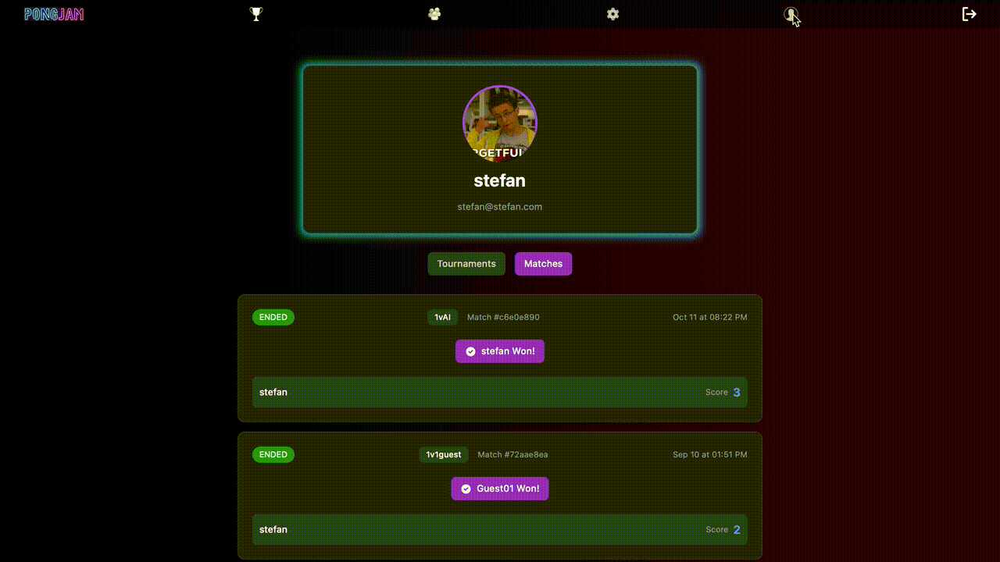
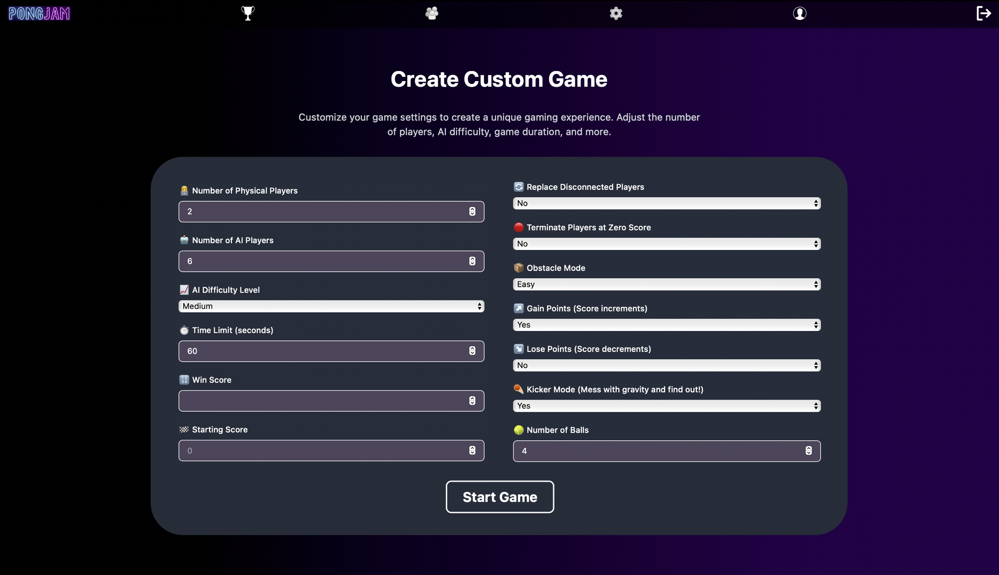
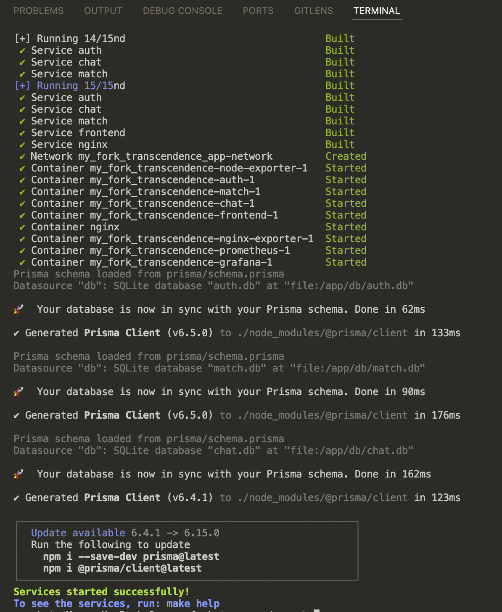
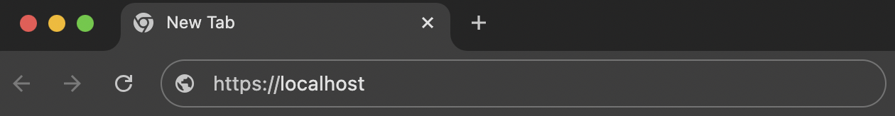
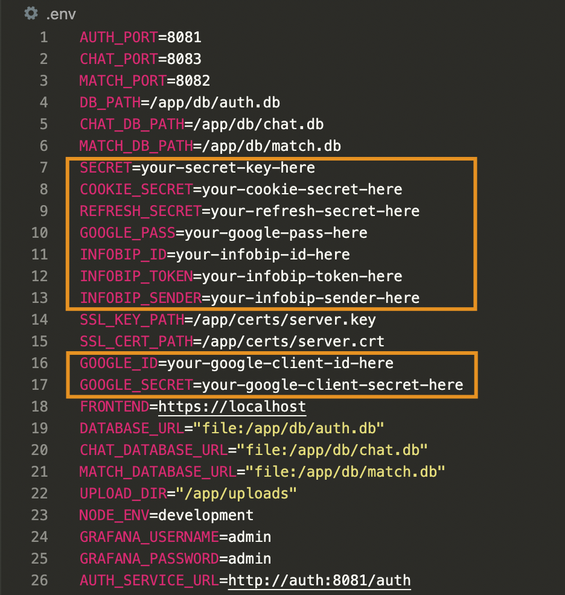

#

# <p align="center">**ft_transcendence**</p>

## <p align="center"> 🕹️ A realtime web-based pong game, _as our graduation project at [42](https://www.42network.org) 🎓_ </p>

### 👥 Team members & collaboration: 
- 🛠️ [Ramy](https://github.com/letsgogeeky): Team & Project Management, Devops, containerization & overall infrastructure 
- 🔐 [Bori](https://github.com/pisakbori): User Management, authentication (2FA & remote), database & microservices for the backend
- 🎮 [Alex](https://github.com/aoprea42): Game component with 3D graphics & AI opponent
- 🎨 [Mary Kate](https://github.com/bitsbyMK): front-end and overall design across the website
- 💬 [Timo](https://github.com/TimoKillinger): live-chat component (tournament & private chat)

#

## 📝 Description

_The goal of this project is to build a modern web platform for the [legendary Pong game](https://en.wikipedia.org/wiki/Pong) 🏓 — but with a twist: multiplayer, tournaments, chat, 3D graphics, and even AI opponents."_ 🚀

In simpler words: imagine gathering with friends, entering your nicknames, and playing Pong directly in your browser 🎮 — not only **one-on-one** on the same keyboard, but also **remotely against players online**, or even against a computer-controlled opponent (**AI**) 🤖. The platform keeps track of who plays against whom, organizes **tournaments** 🏆, and lets you **chat live** 💬 while the games unfold.

💻 Behind the scenes, we combined a frontend in **TypeScript + TailwindCSS** with a backend of **microservices** (for authentication, matchmaking, chat, etc.) powered by **Fastify** and **SQLite**. For security, we added **Google login**, **2-Factor Authentication**, and **JWT tokens**, while monitoring is handled through **Prometheus** & **Grafana**. The game itself is enhanced with **3D visuals** (BabylonJS) that give a fresh look to the classic pong.

✨ In its final form, this project is not just “Pong” — it’s _a full multiplayer gaming experience on the web, reimagined with today’s technologies, AI challenges, and 3D design_. ✨ 

#

<!-- ## 👀 Preview:

https://github.com/user-attachments/assets/b09e53ef-8071-42dd-a90b-62f60663945a -->

## 🎯 Main Components

### 👤 User Management

#### 🔐 Registration & Log In
<table>
  <tr valign="top">
    <td>
      
    </td>
    <td>
        <br>
		<i>User can</i> 💁‍♀️ :<br>
        ✔️ register with <strong>email & password</strong><br>
        ✔️ Log in with credentials<br>
        ✔️ <strong>Log in with Google</strong><br>
        ✔️ <strong>Recover account</strong> if password lost<br>
        ✔️ <strong>Log out</strong> whenever they wish to<br>
    </td>
  </tr>
</table>

<!-- the approach with the table -->
<!-- #### 🔐 Registration & Log In:
| | |
|---|---|
|  | ✔️ User can register with **email and password**, and then <br>✔️ Log in with these credentials, or<br>✔️ ***Log in with Google***, or<br>✔️ **Recover account** through email if password forgotten.<br>✔️ **Log out** whenever they wish to.| -->

#### ⚙️ User Settings
<table>
  <tr valign="top">
    <td>
      
    </td>
    <td>
        <br>
		<i>User can</i> 💁‍♀️ :<br>
        ✔️ Update their <strong>profile picture</strong><br>
        ✔️ <strong>Change username</strong><br>
        ✔️ <strong>Change password</strong><br>
        ✔️ Activate <strong>2-Factor Authentication</strong><br>
        &nbsp;&nbsp;&nbsp;&nbsp;&nbsp;• either with <strong>email code</strong>, or<br>
        &nbsp;&nbsp;&nbsp;&nbsp;&nbsp;• <strong>authenticator app</strong> with QRcode<br>
    </td>
  </tr>
</table>

#### 👤 Profile Information & 📊 Statistics
<table>
  <tr valign="top">
    <td>
      
    </td>
    <td>
        <br>
		<i>User can</i> 💁‍♀️ :<br>
        ✔️ See their <strong>history of matches & tournaments</strong>, in their profile<br>
    </td>
  </tr>
</table>


#### 🤝 Friends Management & 🔎 User Search
<table>
  <tr valign="top">
    <td>
      
    </td>
    <td>
        <br>
		<i>Users can</i> 💁‍♀️ :<br>
        ✔️ <strong>Search</strong> for other users<br>
        ✔️ View other users' <strong>profile information</strong><br>
        ✔️ Send <strong>friend requests</strong><br>
        ✔️ <strong>Accept </strong> or <strong>reject</strong> friend requests<br>
        ✔️ <strong>Unfriend</strong> other users<br>
        ✔️ see if their friends are <strong>Online</strong> or <strong>Offline</strong> <br>
    </td>
  </tr>
</table>

#

### 🏓 THE GAME

💁‍♀️ Can be as simple as:

https://github.com/user-attachments/assets/60552130-2f5f-4b2e-a972-eac6212412eb

🤯 Or, as complicated as:

https://github.com/user-attachments/assets/23fd0bd5-f082-4f41-97c2-b0e5289a9908

#
#### 1️⃣ Ready-to-Play Games 🎮

When the user first enters the platform, they are welcomed by the **Main Page**, where they can choose from the following _predefined game modes_ to **play directly**:


- ⌨️ **1 vs 1 (same keyboard)** – Two players share the same device: one uses the **W A S D** keys, the other uses the **arrow keys**.
- 🤖 **Against AI** – Play a solo **1 vs 1** match against the AI. The game starts at **Level 1**, and each victory unlocks the next, more challenging level.
- 👥 **2 Players (Online)** – Join the matchmaking queue to play a 1 vs 1 match with another player online.
- 👥👥 **4 Players (Online)** – Enter the 4-player queue; once three other players join, the game starts automatically.

#
#### 2️⃣ Custom Games 🖌️

Alternatively, they can click the ***Custom Game*** button on the Main Page (see aboveꜛ) to create a personalized match by adjusting the available game settings:



Using this Custom Game panel, users can _fine-tune nearly every gameplay aspect_:
- ⚙️ **Players**: Choose the number of physical and AI players.
- 🧠 **AI Difficulty**: Adjust from easy to hard for progressive challenge.
- 🕒 **Game Rules**: Set a **time or score limit** to end the match.
- 🧱 **Environment**: Enable **obstacle mode** for extra dynamics.
- ⚡ **Gameplay Options**: Decide whether players can lose points, get replaced by AI if disconnected, or be removed at zero score.
- 🌍 **Physics**: Activate _Kicker Mode_ to apply gravity-based movement to the ball.<br>

💡 With all these combinations, users can create ***hundreds of unique matches***—from quick duels to chaotic multi-ball battles.


#
#### 3️⃣ TOURNAMENTS 🏆


The **Tournaments** module enables users to _create, configure, and manage competitive matches_:
- 🏗️ **Creation**: Define the tournament name and choose the victory condition (time-based or score-based).
- 👑 **Administration**: The creator acts as the admin, managing invitations and controlling the tournament’s start.
- ⚔️ **Gameplay**: Each player faces all other participants in one-on-one matches. The player with the ***highest cumulative score*** across all matches wins.
- 📋 **Overview**: The Tournaments page provides filters to view:
	* all existing tournaments,
	* those the user participates in, or
	* those managed by the user.
#

### 💬 Live Chat

<!-- https://github.com/user-attachments/assets/b44479aa-015d-42f2-a5a4-8ac006729a97 -->


Our platform features a dynamic chat system supporting both **private conversations** 🤝 and **tournament-wide discussions** 🏆.

- **Private Chats** 💌
	* Send direct messages between users.
	* View the recipient’s profile directly from the chat window 👤.
	* Block or unblock other users 🚫.
	* **Invite directly to a 1v1 game** 🎮 — challenge your friend instantly without leaving the chat!
- **Tournament Chats** 🗨️
	* All tournament participants can communicate in a shared chat room.
	* Navigate directly to the tournament page from within the chat 🏓.
	* View the profiles of other participants easily 👥.<br>

Each chat box can be **minimized to the bottom-right corner** 🔽 or **expanded again anytime** ↩️, allowing you to stay connected while continuing your game.


#
### 🛠️ Backend & Monitoring system 

🔩 Our backend follows a ***microservices architecture***, separating the main application logic into smaller, independent services — **Auth**, **Match**, and **Chat**.<br>
This design allows each service to be **developed, tested, deployed, and scaled independently**, improving maintainability and fault isolation.
Using **SQLite** for each microservice provides lightweight persistence with minimal setup overhead, making it ideal for containerized environments and local development.

📊 🧐 For **monitoring and observability**, we integrated a complete stack with ***Prometheus, Grafana, Node Exporter***, and ***Nginx Exporter***.
- Prometheus collects real-time metrics from all services, 
- Grafana visualizes them through interactive dashboards, and 
- the exporters ensure both system-level and Nginx-specific performance data are continuously available.<br>

This setup gives us a _clear view of system health, traffic, and resource usage_ — helping detect issues early and ensure smooth operation.

<details>
  <summary>👈 Expand here to see detailed information about the configuration of the core application services & infrastructure 🔍 </summary>

  #### 🎯 Core Application Services

  1. Auth Service
  - **Location**: `./backend/auth`
  - **Port**: 8081
  - **Protocol**: HTTP
  - **Database**: SQLite at `/app/db/auth.db`

  2. Match Service
  - **Location**: `./backend/match`
  - **Port**: 8082
  - **Protocol**: HTTP
  - **Database**: SQLite at `/app/db/match.db`
  - 🔍 **API docs** at: `https://localhost/match/docs`

  3. Chat Service
  - **Location**: `./backend/chat`
  - **Port**: 8083
  - **Protocol**: HTTP
  - **Database**: SQLite at `/app/db/chat.db`
  - 🔍 **API docs** at: `https://localhost/chat/docs`

  4. Frontend Service
  - **Location**: `./frontend`
  - **Port**: 3000
  - **Protocol**: HTTP

  #### ⚙️ Infrastructure Services

  1. Nginx
  - **Location**: `./infra/nginx`
  - **Ports**:
  - 80 (HTTP)
  - 443 (HTTPS)
  - **Protocol**: HTTP/HTTPS

  2. Nginx Exporter
  - **Image**: `nginx/nginx-prometheus-exporter`
  - **Port**: 9113
  - **Protocol**: HTTP
  - 🔍 **Access**: `http://localhost:9113/metrics`

  3. Node Exporter
  - **Image**: `prom/node-exporter`
  - **Port**: 9100
  - **Protocol**: HTTP
  - 🔍 **Access**: `http://localhost:9100/metrics`

  4. Prometheus
  - **Image**: `prom/prometheus`
  - **Port**: 9090
  - **Protocol**: HTTP
  - 🔍 **Access**: `http://localhost:9090`

  5. Grafana
  - **Image**: `grafana/grafana`
  - **Port**: 3001
  - **Protocol**: HTTP
  - 🔍 **Access**: `http://localhost:3001`

  #### 🛜 Network Configuration
  All services are connected through a bridge network named `app-network`

  #### 💾 Volume Mounts
  Common volumes shared across services:
  - `./certs` (SSL certificates)
  - `./uploads` (file storage)
  - `./db` (database files)

  Each service has its own source code mounted from its respective directory

</details>

#

## ⚙️ Installation

1. Clone the repository:

```bash
git clone https://github.com/letsgogeeky/transcendence
```

2. Navigate to the project's directory:

```bash
cd transcendence
```
<!-- [❕ _Make sure you have  [*Docker*](https://www.docker.com) installed, so that you can move on to..._] -->

<div align="center">

[❕ _Make sure you have  [*Docker*](https://www.docker.com) installed, so that you can move on to..._]

</div>

3. Boot everything up with the help of our magic [`Makefile`](Makefile):

```bash
make up
```

> 🏁 _And if everything boots correctly the output should finish as follows:_


## 🚀 Usage

Now you can go to any broswer and access the website by simply typing:



which should serve you the following main page:


❗️ At this point though, you would only be able to see the main pages _(Welcome, Log In & Sign Up pages)_ without being able to actually sign up & access the game.

💁‍♀️ Let's clarify now **WHY**'s that and what you can do to fully browse the website... 💪

#

### 🔑 The importance of the missing SECRETS in the .env file

When you first do `make up` this generates some certificates (`server.crt`, `server.csr`, `server.key`) and the following **`.env`** file:



This `.env file` is considered _"enough"_ for the containers to boot up and the frontend to be accessed at https://localhost. ❗️ However, it uses <span style="color:#9667F0;">placeholder values</span> (_the ones in the purple boxes above_) like `your-secret-key-here`, which means <span style="color:#F54570;">the core functionality (registration, login, SMS, Google OAuth, etc) will not work until they are replaced with **real credentials**.</span> ❗️❗️


<!-- - **Secrets** (`SECRET`, `COOKIE_SECRET`, `REFRESH_SECRET`): You can generate your own with `openssl rand -hex 32`.
- **Google OAuth** (`GOOGLE_ID`, `GOOGLE_SECRET`): You can obtain from Google Cloud Console.
- **Google App Password** (`GOOGLE_PASS`): You can generate from your Google Account → Security → App Passwords.
- **Infobip SMS** (`INFOBIP_ID`, `INFOBIP_TOKEN`, `INFOBIP_SENDER`): You can obtain from your Infobip Dashboard. -->

#### 🔎 Explanation of the necessary Secrets & How they can be obtained:

| Secrets | Functionality | How to Obtain |
|---------|----------------------------|---------------|
| SECRET, <br>COOKIE_SECRET, <br>REFRESH_SECRET | Are used to generate and verify JWTs or **session cookies**. Without real values, authentication tokens will either fail to generate or won’t validate. | You can generate your own with `openssl rand -hex 32`. |
| GOOGLE_PASS, <br>GOOGLE_ID, <br>GOOGLE_SECRET | Are required if the platform supports Google OAuth. Without them, **Google login** won’t work at all. | GOOGLE_ID, GOOGLE_SECRET: Obtain from Google Cloud Console.<br>GOOGLE_PASS: Generate from your Google Account → Security → App Passwords. |
| INFOBIP_ID, <br>INFOBIP_TOKEN, <br>INFOBIP_SENDER | Are for SMS verification (or similar). Without them, **phone-based 2FA** or notifications won’t work. | You can obtain from your Infobip Dashboard. |

<br>

✨ Once you get those 9 values, you can add them in the `.env` (_replacing the current placeholder values_), then you do `make up` again, and now you have the fully working website, where you can sign up and log in to play the game and access all features 🥳 🎉, as shown in the [Main Components](https://github.com/bitsbyMK/transcendence?tab=readme-ov-file#-main-components) above.

## 📘 Subject Modules
This project contains the following modules from the _New Subject_:

- Major module: Use a framework to build the backend. (**fastify**)
- Minor module: Use a framework or toolkit to build the front-end. (**TailwindCSS**)
- Minor module: Use a database for the backend -and more. (**SQLite**)
- Major module: Standard user management, authentication and users across tournaments. (**Auth**)
- Major module: Implement remote authentication. (**Google Auth**)
- Major module: **Remote players** (socket.io)
- Major module: **Multiple players** (socket.io, multiple clients)
- Major module: **Live Chat**. (socket.io)
- Major module: Implement **Two-Factor Authentication** (2FA) and **JWT**. (Auth + SQLite + fastify-jwt)
- Minor module: Monitoring system. (**Prometheus, Grafana, Node Exporter, Nginx Exporter**)
- Major module: Designing the **Backend as Microservices**. (Auth, Match, Chat)
- Major module: Implementing Advanced **3D Techniques**. (BabylonJS)

Count of Major modules: 9 <br>
Count of Minor modules: 3<br>
Total: 10.5<br>

## 📜 License

This project is released under the [MIT License](https://github.com/bitsbyMK/transcendence?tab=License-1-ov-file). Contributions are welcome!