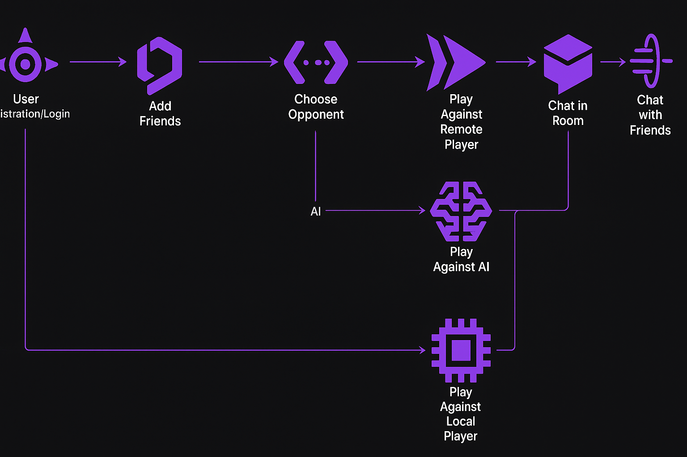

#

# <p align="center">**ft_transcendence**</p>

## <p align="center"> 🕹️ A realtime web-based pong game, _as our graduation project at [42](https://www.42network.org) 🎓_ </p>

### 👥 Team members & collaboration: 
- 🛠️ [Ramy](https://github.com/letsgogeeky): Team & Project Management, Devops, containerization & overall infrastructure 
- 🔐 [Bori](https://github.com/pisakbori): User Management, authentication (2FA & remote), database & microservices for the backend
- 🎮 [Alex](https://github.com/aoprea42): Game component with 3D graphics & AI opponent
- 🎨 [Mary Kate](https://github.com/MaryKateEvan): front-end and overall design across the website
- 💬 [Timo](https://github.com/TimoKillinger): live-chat component (tournament & private chat)

#

## 📝 Description

_The goal of this project is to build a modern web platform for the [legendary Pong game](https://en.wikipedia.org/wiki/Pong) 🏓 — but with a twist: multiplayer, tournaments, chat, 3D graphics, and even AI opponents."_ 🚀

In simpler words: imagine gathering with friends, entering your nicknames, and playing Pong directly in your browser 🎮 — not only **one-on-one** on the same keyboard, but also **remotely against players online**, or even against a computer-controlled opponent (**AI**) 🤖. The platform keeps track of who plays against whom, organizes **tournaments** 🏆, and lets you **chat live** 💬 while the games unfold.

💻 Behind the scenes, we combined a frontend in **TypeScript + TailwindCSS** with a backend of **microservices** (for authentication, matchmaking, chat, etc.) powered by **Fastify** and **SQLite**. For security, we added **Google login**, **2-Factor Authentication**, and **JWT tokens**, while monitoring is handled through **Prometheus** & **Grafana**. The game itself is enhanced with **3D visuals** (BabylonJS) that give a fresh look to the classic pong.

✨ In its final form, this project is not just “Pong” — it’s _a full multiplayer gaming experience on the web, reimagined with today’s technologies, AI challenges, and 3D design_. ✨ 

#

## 👀 Preview:

https://github.com/user-attachments/assets/b09e53ef-8071-42dd-a90b-62f60663945a

## 🎯 Main Components

### 👤 User Management

#### 🔐 Registration & Log In

&nbsp;&nbsp;✔️ User can register with **email and password**, and then <br>
&nbsp;&nbsp;✔️ Log in with these credentials, or<br>
&nbsp;&nbsp;✔️ ***Log in with Google***, or<br>
&nbsp;&nbsp;✔️ **Recover account** through email if password forgotten.<br>
&nbsp;&nbsp;✔️ **Log out** whenever they wish to.
#
#### ⚙️ User Settings

&nbsp;&nbsp;✔️ User can update their **profile picture**<br>
&nbsp;&nbsp;✔️ **Change username**<br>
&nbsp;&nbsp;✔️ **Change Password**<br>
&nbsp;&nbsp;✔️ Activate ***2-Factor Authentication***:<br>
&nbsp;&nbsp;&nbsp;&nbsp;&nbsp;&nbsp;• either with **email code**, or <br>
&nbsp;&nbsp;&nbsp;&nbsp;&nbsp;&nbsp;• **authenticator app** with QRcode.
#
#### 👤 Profile Information & 📊 Statistics

&nbsp;&nbsp;✔️ User can see their **history of matches** and **tournaments** in their profile.
#
#### 🤝 Friends Management & 🔎 User Search
- User can search for other users
- User can view other users' profile information
- User can send friend requests to other users
- User can accept or reject friend requests
- User can unfriend other users
#
#### 🎯 Matchmaking System
- User can create a match
- User can join a match
- User can leave a match
- User can view other users' match history
- User can view other users' match stats
- User can view other users' match achievements

#

### 🏓 THE GAME
- User can see in real-time the game and the other players
- User can chat with other players
- User can see the game stats (score, etc..)
- User can leave the game at any time
- User can play in different modes (1v1, 2v2, 3v3, etc..)
- Opponents can be:
	* Other player on the same device using different keyboard keys
	* AI (pre-defined level of difficulty)
	* Other players on different devices (using the same keyboard keys)

#### 🏆 TOURNAMENTS

#
### 💬 Live Chat
- Chat with other players during matches
<!--  -->

#
### ⚙️ Backend & Microservices
- Auth, Match, and Chat services
- Handles matchmaking & live game state
<!--  -->

#
### 📊 Monitoring & Infrastructure
- Prometheus + Grafana metrics
- Nginx routing
<!--  -->


## ⚙️ Installation

1. Clone the repository:

```bash
git clone https://github.com/letsgogeeky/transcendence
```

2. Navigate to the project's directory:

```bash
cd transcendence
```
<!-- [❕ _Make sure you have  [*Docker*](https://www.docker.com) installed, so that you can move on to..._] -->

<div align="center">

[❕ _Make sure you have  [*Docker*](https://www.docker.com) installed, so that you can move on to..._]

</div>

3. Boot everything up with the help of our magic [`Makefile`](Makefile):

```bash
make up
```

> 🏁 _And if everything boots correctly the output should finish as follows:_


## 🚀 Usage

Now you can go to any broswer and access the website by simply typing:


which should serve you the following main page:


❗️ At this point though, you would only be able to see the main pages _(Welcome, Log In & Sign Up pages)_ without being able to actually sign up & access the game.

💁‍♀️ Let's clarify now **WHY**'s that and what you can do to fully browse the website... 💪

#

### 🔑 The importance of the missing SECRETS in the .env file

When you first do `make up` this generates some certificates (`server.crt`, `server.csr`, `server.key`) and the following **`.env`** file:


This `.env file` is considered _"enough"_ for the containers to boot up and the frontend to be accessed at https://localhost. ❗️ However, it uses <span style="color:#9667F0;">placeholder values</span> (_the ones in the purple boxes above_) like `your-secret-key-here`, which means <span style="color:#F54570;">the core functionality (registration, login, SMS, Google OAuth, etc) will not work until they are replaced with **real credentials**.</span> ❗️❗️


<!-- - **Secrets** (`SECRET`, `COOKIE_SECRET`, `REFRESH_SECRET`): You can generate your own with `openssl rand -hex 32`.
- **Google OAuth** (`GOOGLE_ID`, `GOOGLE_SECRET`): You can obtain from Google Cloud Console.
- **Google App Password** (`GOOGLE_PASS`): You can generate from your Google Account → Security → App Passwords.
- **Infobip SMS** (`INFOBIP_ID`, `INFOBIP_TOKEN`, `INFOBIP_SENDER`): You can obtain from your Infobip Dashboard. -->

#### 🔎 Explanation of the necessary Secrets & How they can be obtained:

| Secrets | Functionality | How to Obtain |
|---------|----------------------------|---------------|
| SECRET, <br>COOKIE_SECRET, <br>REFRESH_SECRET | Are used to generate and verify JWTs or **session cookies**. Without real values, authentication tokens will either fail to generate or won’t validate. | You can generate your own with `openssl rand -hex 32`. |
| GOOGLE_PASS, <br>GOOGLE_ID, <br>GOOGLE_SECRET | Are required if the platform supports Google OAuth. Without them, **Google login** won’t work at all. | GOOGLE_ID, GOOGLE_SECRET: Obtain from Google Cloud Console.<br>GOOGLE_PASS: Generate from your Google Account → Security → App Passwords. |
| INFOBIP_ID, <br>INFOBIP_TOKEN, <br>INFOBIP_SENDER | Are for SMS verification (or similar). Without them, **phone-based 2FA** or notifications won’t work. | You can obtain from your Infobip Dashboard. |

<br>

✨ Once you get those 9 values, you can add them in the `.env` (_replacing the current placeholder values_), then you do `make up` again, and now you have the fully working website, where you can sign up and log in to play the game and access all features 🥳 🎉 

<!-- ### 🧭 USER JOURNEY
 -->

Let's explore now the different pages and functionality of the Website:

<!-- ### User Registration


## 🛠️ Some more technical Info

For more detailed information regarding the infrastructure and **core application services**, check [here](./docs/SERVICES.md) 👈 🔍 -->

## 🛠️ Services Configuration

<details>
  <summary>👈 Expand here to view more detailed information regarding the configuration of the core application services & infrastructure  🔍</summary>

  ### 🎯 Core Application Services

  #### 1. Auth Service
  - **Location**: `./backend/auth`
  - **Port**: 8081
  - **Protocol**: HTTP
  - **Database**: SQLite at `/app/db/auth.db`

  #### 2. Match Service
  - **Location**: `./backend/match`
  - **Port**: 8082
  - **Protocol**: HTTP
  - **Database**: SQLite at `/app/db/match.db`
  - 🔍 **API docs** at: `https://localhost/match/docs`

  #### 3. Chat Service
  - **Location**: `./backend/chat`
  - **Port**: 8083
  - **Protocol**: HTTP
  - **Database**: SQLite at `/app/db/chat.db`
  - 🔍 **API docs** at: `https://localhost/chat/docs`

  #### 4. Frontend Service
  - **Location**: `./frontend`
  - **Port**: 3000
  - **Protocol**: HTTP

  ### ⚙️ Infrastructure Services

  #### 1. Nginx
  - **Location**: `./infra/nginx`
  - **Ports**:
  - 80 (HTTP)
  - 443 (HTTPS)
  - **Protocol**: HTTP/HTTPS

  #### 2. Nginx Exporter
  - **Image**: `nginx/nginx-prometheus-exporter`
  - **Port**: 9113
  - **Protocol**: HTTP
  - 🔍 **Access**: `http://localhost:9113/metrics`

  #### 3. Node Exporter
  - **Image**: `prom/node-exporter`
  - **Port**: 9100
  - **Protocol**: HTTP
  - 🔍 **Access**: `http://localhost:9100/metrics`

  #### 4. Prometheus
  - **Image**: `prom/prometheus`
  - **Port**: 9090
  - **Protocol**: HTTP
  - 🔍 **Access**: `http://localhost:9090`

  #### 5. Grafana
  - **Image**: `grafana/grafana`
  - **Port**: 3001
  - **Protocol**: HTTP
  - 🔍 **Access**: `http://localhost:3001`

  ### 🛜 Network Configuration
  All services are connected through a bridge network named `app-network`

  ### 💾 Volume Mounts
  Common volumes shared across services:
  - `./certs` (SSL certificates)
  - `./uploads` (file storage)
  - `./db` (database files)

  Each service has its own source code mounted from its respective directory

</details>

## 🧠 Additional Info for 42 Students:

### 📘 Subject Modules We Chose:

- Major module: Use a framework to build the backend. (fastify)
- Minor module: Use a framework or toolkit to build the front-end. (TailwindCSS)
- Minor module: Use a database for the backend -and more. (SQLite)
- Major module: Standard user management, authentication and users across tournaments. (Auth)
- Major module: Implement remote authentication. (Google Auth)
- Major module: Remote players (socket.io) To be tested.
- Major module: Multiple players (socket.io, multiple clients) To be tested.
- Major module: Live Chat. (socket.io) To be tested. and continue feature-set required
- Major module: Implement Two-Factor Authentication (2FA) and JWT. (Auth + SQLite + fastify-jwt)
- Minor module: Monitoring system. (Prometheus, Grafana, Node Exporter, Nginx Exporter)
- Major module: Designing the Backend as Microservices. (Auth, Match, Chat)
- Major module: Implementing Advanced 3D Techniques. (BabylonJS)

Count of Major modules: 9 Count of Minor modules: 3

Total: 10.5

### 🧾 Decision Records — 💡 Advice From Our Experience

✔️ Use the new subject **Fastify** is a good lightweight and flexible framework.

✔️ **Backend as Microservices**. We have a good opportunity to build each backend component independently since we're using SQLite. (User Management, Match Making System, Real-time server for gaming, live chat, etc..) each one of these components can be built independently.

## 🙌 &nbsp;Acknowledgements

## 📜 License

This project is released under the [MIT License](https://github.com/MaryKateEvan/transcendence?tab=License-1-ov-file). Contributions are welcome!